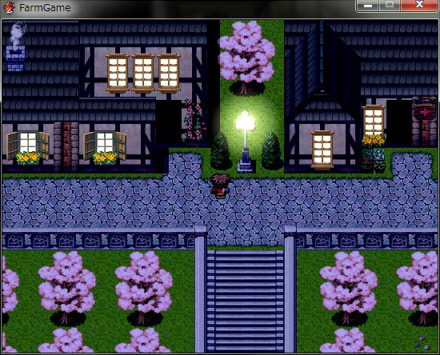

### RGSS3_FarmGame
>**概要**  
> 色調変化すると全てのタイルが色調の下になり、夜に光る窓を表現したくてもできない。  
> 色調の上にもう一つのタイルマップを作成して、光った窓のみを置けるスクリプトを作成した。  

---

##### 設定項目
- TilePair：昼用タイルセット番号と夜用タイルセット番号のペアを設定
- self.luminous?：夜用タイルセットを表示する条件

##### 再定義
- Game_Map：再定義というか夜用タイルセットが取得できるようにした。
- Spriteset_Map：もう一つのタイルマップ作成と夜用タイルセットの配置。
